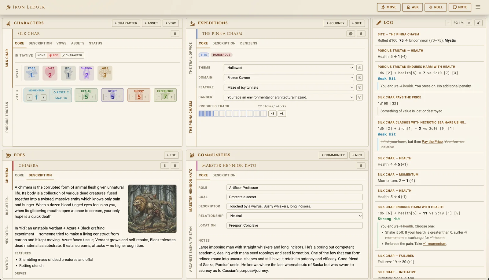

# Iron Ledger

Ironsworn TTRPG character tracker. Manage characters, track progress, roll moves, consult oracles, and run expeditions — all in a web-based interface with real-time state persistence.

- This was a first foray into using Claude to do all the coding. It's an experiment not a social commentary.
- That being said, the AI generated images for foes are slop, I'd be open to working with a willing artist to make these much nicer.
- I am not a designer, suggestions for improving the UI are most welcome.
- I have probably misintrepreted or missed a rule here or there, bug reports are definitely welcome.
- **Ironsworn and the Delve Expansion** are incredible RPGs, I highly encourage you to support [Shawn Tomkin](https://tomkinpress.com/) and purchase his work.

A final note: The YRT expansion that is referred to is a side project I'm working on set in a post-apocalyptic world where technology is indistinguishable from magic.
I'm not ready to release anything yet but you can see some of the the workings in the Conclave spells, the use of mana, and some Oracles.

## Screenshot



## Tech Stack

| Layer        | Technology                                                                        |
| ------------ | --------------------------------------------------------------------------------- |
| **Frontend** | SvelteKit 2 + Svelte 5 (runes), adapter-node SSR                                  |
| **API**      | Fastify 5, TypeScript, Zod validation                                             |
| **Database** | PostgreSQL 16 with Row-Level Security (Drizzle ORM)                               |
| **Cache**    | Redis (Valkey) — rate limiting, maintenance mode                                  |
| **Auth**     | JWT RS256 (15-min access + 30-day rotating refresh tokens, auto-refresh in hooks) |
| **Process**  | PM2 (cluster mode for API, fork for web)                                          |
| **Proxy**    | Nginx with TLS (Let's Encrypt), rate limiting                                     |

## Monorepo Structure

```
ironledger/
  apps/
    api/          Fastify REST API (port 3000)
    web/          SvelteKit frontend (port 5173 dev / 3001 prod)
  packages/
    shared/       Shared TypeScript types and game data
  infra/
    nginx/        Production Nginx config
    scripts/      Server setup, deploy, backup scripts
    docker/       Dev database containers
  docs/           Feature documentation
```

## Quick Start

### Prerequisites

- Node.js 22+ (pinned in `.nvmrc` — run `nvm use` to select it)
- PostgreSQL 16+ (or Docker)
- Redis 7+ (or Docker)

### Development Setup

```bash
# 1. Clone and install
git clone <repo-url> && cd ironledger
npm install

# 2. Start database services (Docker)
docker compose up -d
# Or use: ./infra/scripts/dev-db.sh up

# 3. Create .env from template
cp .env.example .env
# Edit .env — generate JWT keys with:
#   openssl genrsa -out private.pem 2048
#   openssl rsa -in private.pem -pubout -out public.pem

# 4. Run database migrations
npm run migrate

# 5. Seed development data (optional)
npm run seed --workspace=apps/api

# 6. Start dev servers (two terminals)
npm run dev       # API on :3000
npm run dev:web   # Web on :5173
```

### Dev Credentials

| Account | Email                    | Password            |
| ------- | ------------------------ | ------------------- |
| Admin   | `admin@ironledger.local` | `adminpassword123!` |
| User    | `dev@ironledger.local`   | `devpassword123!`   |

### Code Style

ESLint and Prettier are wired into the monorepo and enforced in CI (the
build fails on ESLint errors or a Prettier diff). Run from the repo root:

```bash
npm run lint          # ESLint across api, web (incl. Svelte), and shared
npm run lint:fix      # ESLint with autofix
npm run format        # Prettier — rewrite all files in place
npm run format:check  # Prettier — verify formatting (what CI runs)
```

Config lives in `eslint.config.js` (flat config) and `.prettierrc.json`.
Prettier uses 2-space indent for `apps/api` and `packages/shared`, and tabs
for `apps/web` (matching the Svelte tab convention). `any` and unused-var
findings are surfaced as warnings, not errors, so they don't block CI.

## Features

### Character Management

- Create and manage Ironsworn characters
- Full character sheet with stats, tracks, assets, and vows
- Auto-save with 1500ms debounce

### Moves & Dice

- Complete Ironsworn move reference with picker grid
- Action, progress, and spell rolls with 3D animated dice
- Live roll formula display (e.g., `d6 + iron[3] + adds[+1] vs d10 & d10`) between spinners and roll button
- Data-driven progress routing: each progress move reads from the correct track (foe, journey, site, bonds, failures) via `progressSource` field
- Move precondition checking (disables moves with unmet requirements)
- Burn momentum to upgrade roll outcomes
- Clickable move cross-references in outcome text
- Strong Hit / Weak Hit / Miss outcomes shown in move detail view

### Oracles

- Oracle table consultation with random rolls
- Linked oracle chains
- "Roll Twice" results auto-combine two independent re-rolls into one result

### Foes & Encounters

- Full foe catalogue from Ironsworn core, Delve supplement, and YRT homebrew
- Per-character encounter tracking with progress tracks
- Ranks 1–5 (Troublesome → Epic) with progress mechanics
- **Escalating Harm** (YRT): foe harm starts at 1 and increases on each Miss; capped at effective rank
- **Escalating Defense** (YRT): foe projects a mana shield that absorbs strikes; defense erodes on each Miss and blocks progress marks while active; cap = progress-per-hit for that rank

### Expeditions

- Journey and Delve Site expedition types
- Progress tracks with waypoint/room mechanics
- Delve tables for site exploration

### Communities & NPCs

- Track settlements and the people who inhabit them
- Oracle-powered random generation for community names, locations (inland/coastal), and NPC names (Ironlander, Elf, Giants, Varou, Trolls variants)
- Free-form notes, region, trouble, and relationship fields per entry
- 3-column responsive grid layout

### Mobile Support

- Responsive layout down to 360px; tested on Surface Duo (540px breakpoint for icon-only tabs)
- Horizontal **swipe-to-switch-tab** on the home page (direction and distance thresholds filter out vertical scrolls and taps); opt out per-element with `data-no-swipe-tabs`
- On Adventure, a drag-to-resize **split panel** replaces the desktop side-by-side layout: GCB on top, session log below, both scroll independently, split persists to localStorage
- Picker dialogs (Foes, Moves, Oracles) size to `min(85dvh, 720px)` so they don't collapse behind mobile browser chrome
- Collapsible glass search pill on Expeditions and Communities to reclaim toolbar space on narrow screens
- Body scroll lock when modal pickers or the Adventure split panel are active

### Session Log

- Persistent session log with interactive links
- Resource changes, moves, oracles, progress, initiative, debilities, menace links
- State-modifying links with strikethrough after click
- Auto-appended "Momentum: Burn Available" log entry when burn is possible on action roll results
- Cascade rules auto-append log entries on resource floor events:
  - **Overflow**: health/spirit drops below 0 → excess converts to momentum loss
  - **Floor**: supply hits 0 → "Supply: Exhausted" with Unprepared debility link; momentum hits −6 → note appended
  - **Floor overflow**: resource already at minimum → "Face a Setback", "Face Death", "Face Desolation", or "Out of Supply" entries with per-point clickable exchange links
- Export includes timestamps for each entry

### Initiative Tracking

- Per-character initiative badges (sword/shield icons) on GCB and character sheet
- Automatically clears when foe is deselected

### Admin Panel _(admin users only)_

Integrated into the home page as a dedicated **Admin** tab (screwdriver-wrench icon, only visible to admin-role users).

- **Users tab** — sortable user table with pagination, role management (promote/demote/suspend), user delete
- **Logs tab** — live PM2 server log viewer (API/web stdout & stderr), filter, expandable JSON rows
- **Maintenance tab** — enable/disable maintenance mode with countdown, message, session revocation
- **Registration tab** — lock/unlock new account creation with a custom message

### Maintenance Mode

- Redis-backed system maintenance state shared across instances
- Global countdown banner for all users (polls every 10s)
- Blocks non-admin logins during maintenance
- Revokes all refresh tokens to force logoff
- Admin bypass for login during maintenance
- Full audit logging of maintenance events

### Registration Lock

- Admin can disable new user registration without triggering full maintenance mode
- Locked state shows a custom message on the `/register` page with a link to sign in
- Backed by Redis — survives server restarts

## Scripts

| Command             | Description                 |
| ------------------- | --------------------------- |
| `npm run dev`       | Start API dev server        |
| `npm run dev:web`   | Start web dev server        |
| `npm run build`     | Build both API and web      |
| `npm run test`      | Run API test suite (vitest) |
| `npm run migrate`   | Run database migrations     |
| `npm run check:web` | TypeScript check for web    |

## Deployment

See [docs/deployment.md](docs/deployment.md) for complete IONOS VPS deployment instructions including:

- One-time server provisioning
- Pushbutton CI/CD via GitHub Actions
- Manual deploy script with rollback
- Database backup strategy
- Horizontal scaling guide
- Maintenance mode workflow

## Documentation

Feature docs are in the `docs/` directory:

| Doc                                                         | Description                                                  |
| ----------------------------------------------------------- | ------------------------------------------------------------ |
| [admin.md](docs/admin.md)                                   | Admin panel — users, logs, maintenance, registration lock    |
| [architecture_decisions.md](docs/architecture_decisions.md) | Architecture and design decisions                            |
| [character-sheet.md](docs/character-sheet.md)               | Character sheet component                                    |
| [communities.md](docs/communities.md)                       | Communities & NPCs — data model, oracle generation           |
| [data-format.md](docs/data-format.md)                       | Catalogue data format spec (moves, assets, oracles, foes)    |
| [deployment.md](docs/deployment.md)                         | IONOS VPS deployment guide                                   |
| [dice-rolling.md](docs/dice-rolling.md)                     | Dice rolling implementation                                  |
| [expansion-toggles.md](docs/expansion-toggles.md)           | Delve / YRT expansion toggle system                          |
| [expeditions.md](docs/expeditions.md)                       | Expeditions system                                           |
| [foes.md](docs/foes.md)                                     | Foes and encounters                                          |
| [global-context-bar.md](docs/global-context-bar.md)         | GlobalContextBar tile layout                                 |
| [log.md](docs/log.md)                                       | Session log with interactive links                           |
| [mobile.md](docs/mobile.md)                                 | Mobile layout, swipe gestures, and viewport behaviour        |
| [moves.md](docs/moves.md)                                   | Moves system and dice rolling                                |
| [notes.md](docs/notes.md)                                   | Notes dialog                                                 |
| [oracles.md](docs/oracles.md)                               | Oracle tables                                                |
| [ui-components.md](docs/ui-components.md)                   | Shared UI design specs (cards, pills, tooltips, side labels) |
| [yrt/data-format-yrt.md](docs/yrt/data-format-yrt.md)       | YRT homebrew data format extensions                          |

## Credits

- **[Ironsworn](https://ironswornrpg.com/)** and **Ironsworn: Delve** by Shawn Tomkin — licensed under [CC BY-NC-SA 4.0](https://creativecommons.org/licenses/by-nc-sa/4.0/). Game data sourced from [Datasworn](https://github.com/rsek/datasworn) by rsek.
- **[game-icons.net](https://game-icons.net)** — game-themed SVG icons (CC BY 3.0)
- **[Font Awesome](https://fontawesome.com)** — UI icons (Free tier, CC BY 4.0)

## Security

- SSH key-only auth, UFW firewall, fail2ban
- HTTPS with HSTS, CSP, X-Frame-Options (Helmet + Nginx)
- Rate limiting at Nginx and API layers (Redis-backed)
- PostgreSQL Row-Level Security
- Argon2id password hashing (OWASP 2024)
- HaveIBeenPwned password checking
- hCaptcha on registration
- JWT RS256 with refresh token rotation and theft detection
- 64KB request body limit
