<!-- GENERATED by scripts/gen-yrt-reference.mjs — do not edit by hand.
     Source of truth: extensions/yrt/. Run `npm run gen:yrt-ref`. -->

# YRT Bestiary

## Preface

Yrt is a world after a fall. The Unmade — the industrialised humans who came before — collapsed under an ecological catastrophe of their own making, and the manite they once mined and refined at industrial scale now bleeds untended from the wounds they left behind. Those wounds are called blight zones. The mana that seeps from them is unrefined, unstable, and dangerous, and the creatures, constructs, and people that have spent too long near them are this bestiary.

There is no supernatural in Yrt. There are no souls, no ghosts, no spirits, no gods, no divine magic, no prophecy. Every "monster" is one of five things:

- **A wild mana phenomenon** — a self-organising weather-system of unbound mana, drifting toward warmth or matter or other mana, with no maker and no mind.
- **A mana-saturated body** — a corpse or organism that has soaked in a contaminated environment long enough that its tissues now respond to local mana rather than to its original biology.
- **A pre-Fall artefact** — a piece of Unmade technology that still functions, still leaks, or still executes orders given to it by a chain of command that has been dead for centuries.
- **A deliberately built construct** — a modern object, usually illegal or quietly tolerated, made by an artificer or order with the skill to bind matter to purpose. Most require a living handler nearby to function.
- **An altered living person** — a human who has been changed, willingly or not, by mana exposure, surgical implant, or deliberate ritual.

Folk belief in Yrt does not match the truth. Common Ironlanders still call mire forms "bog rots," tomb walkers "wights," and echoes "haunts," and the Conclave does not always correct them. The truth is for the party to discover.

### The factions and what they want from mana

**The Conclave** is the licensing authority for all legitimate magical practice in the western reaches. They run the refineries, control the supply chain, train the mages, and enforce the laws against unsanctioned mana use. The Conclave's primary refinement operation is at **Ravenna**, a vast blight site that has been worked for decades and is the source of most legally available manite in Freeport and the surrounding territories. Conclave mages are organised by specialty: **Vizion** (Amber-trained, sensory and compulsion work), **Verdant Keepers** (Verdant-trained, agricultural and biological), and various others.

The **Pura Ecclesia** is a religious order with a strong Luminous and Azure orientation — wards, healing, sanctuary. Theologically they oppose the use of dead matter and the animation of the inert, which makes their one notable construct (see Vow Walker) a doctrinal contradiction they have learned to live with.

The **Brotherhood** is an assassin guild. They do not use mana. They are not at war with the Conclave. They are professionals, hired by whoever pays, and they operate by mundane means — blade, poison, infiltration, knowledge. Recently, elements of the Brotherhood have entered into a quiet partnership with the Pura Ecclesia to set up a second refinement site at **Spero** and smuggle the product into Freeport, undercutting the Conclave's monopoly. The operation suffers from inexperience: their refinement technique is crude, and a non-trivial fraction of their shipments arrives **tainted with Black mana**. Black-tainted mana is dangerous to the user, traceable by the Conclave, and increasingly common in low-cost seeds circulating in Freeport's underworld.

### Verdani and the recharge question

**The Elves** are not mystical forest spirits and they call themselves the Verdani. They are humanoid populations who have lived for many generations in deep Verdant-saturated regions, and the cumulative mana exposure has changed them — they are now what the bestiary entries call _verdant-tainted humanoids_. They have an instinctive working relationship with Verdant mana that no Conclave-trained Keeper can match, and they can produce constructs (mask risen, greatmasks) of a kind no other group can replicate.

Standard Conclave mages refill their pool by meditation: they absorb ambient **Gray** mana from the environment, at a rate of roughly +1 per hour of rest. All other colors must be purchased from Conclave depots.

The Verdani are the exception.\*\* Through training, lifestyle, and possibly some degree of physical adaptation, a Verdani can perform a Verdant–Crimson photosynthesis: their Verdant cells capture sunlight in the manner of chlorophyll, and the resulting energy is stored as Crimson. A Keeper resting in direct sun recharges red and green mana directly, without paying the Conclave a copper. This is one of the reasons the Conclave keeps a careful eye on them.

### The five mechanism families at a glance

| Mechanism                     | Foes                                                                   |
| ----------------------------- | ---------------------------------------------------------------------- |
| Wild mana phenomena           | Mire Form, Wisp Walker, Drowning Eye, Locus, Witherwind, Carrion Mound |
| Mana-saturated bodies         | Coldhusk, Bloater, Verdant Crawler                                     |
| Pre-Fall artefacts            | The Whispering Stones, Echo, War Pile                                  |
| Deliberately built constructs | Puppet Bones, Mask Risen, Greatmask, Vow Walker                        |
| Altered living people         | Carrier, Tomb Walker, Blighted Guilder, Amber Schemer, The Tainted     |
| Contaminated sites            | Rotwell                                                                |

---

## YRT Extended Mechanics

Two optional mechanics extend the base Ironsworn foe rules. They are additive — they don't replace any core rules and can coexist on the same foe.

### Escalating Harm

Some foes deal more harm as the encounter wears on. Harm starts at 1 and increases by 1 on each **Miss** (use the Escalating Harm spinner). The cap equals the foe's effective rank. On a **Strong Hit** while enduring harm, you may reduce the harm by one.

| Rank            | Harm cap |
| --------------- | -------- |
| 1 – Troublesome | 2        |
| 2 – Dangerous   | 3        |
| 3 – Formidable  | 4        |
| 4 – Extreme     | 5        |
| 5 – Epic        | 5        |

_Foes: Necrotic Sea Hare_

### Escalating Defense

Some foes carry a Gray-mana defense that builds up on each miss, making progress progressively harder to mark. Defense starts at **0** and increases by **1** on each Miss. As it builds, each progress mark puts in fewer ticks. You can always mark progress — but the more the armor consolidates, the less each mark counts.

- **On a Miss**, press **+** on the Escalating Defense spinner to increase defense by 1.
- **You can still mark progress** at any time, but ticks per mark = `progressPerHit − currentDefense` (minimum 1).
- The max defense = `progressPerHit − 1` for the foe's effective rank.

| Rank            | progressPerHit | Max defense |
| --------------- | -------------- | ----------- |
| 1 – Troublesome | 12             | 11          |
| 2 – Dangerous   | 8              | 7           |
| 3 – Formidable  | 4              | 3           |
| 4 – Extreme     | 2              | 1           |
| 5 – Epic        | 1              | 0           |

_Foes: Blighted Guilder, Tomb Walker._

## 1. Amber Schemer

*An amber schemer — a rogue Vizion, unnervingly calm, whose implant glows faintly warm beneath one iris as they read the room.*

**Rank:** 3 — Formidable · **Nature:** Ironlander (rogue Vizion)

**Features:**
- Unnervingly calm and pleasant demeanor
- Amber implant visible behind one eye as a faint warm glow under the iris
- Never raises their voice, never loses their composure
- Always notices what other people in the room are feeling

**Drives:**
- Manipulate those around them for personal gain — wealth, power, influence, or simply control
- Avoid direct confrontation at all costs

**Tactics:**
- Project false trust and calm through low-level Amber Compulsion
- When stakes rise, plant a Directive Compulsion to turn an ally against the party
- When the manipulation is exposed, flee — leaving behind a confused, compelled scapegoat who genuinely believes the schemer's narrative

A Vizion is a Conclave-licensed Amber-trained mage. Vizion are trained for sensory work, for compulsion within sanctioned limits, and for diagnostic and investigative tasks where reading a person's emotional or cognitive state is useful. The Conclave's licensing for Vizion is unusually strict, because the operating envelope of Amber mana — emotional steering, directive compulsion, memory editing — overlaps almost exactly with the operating envelope of a competent abuser.

An amber schemer is a Vizion who has crossed the line. The cause varies: some begin as ordinary Vizion who discover that a small, undetectable compulsion makes their work easier and never stop expanding the technique. Some are lifelong manipulators who pursued Vizion training specifically as a force-multiplier. A few are former Conclave investigators who learned the limits of the licensing system from the inside and now operate just outside it.

The schemer's working method is patient. They build influence over weeks or months — a small nudge in conversation, a moment of unearned trust, a recurring sense that this is a person to whom one tells the truth. By the time the target realises something is wrong, the schemer has already extracted what they wanted and moved on.

## 2. Blighted Guilder

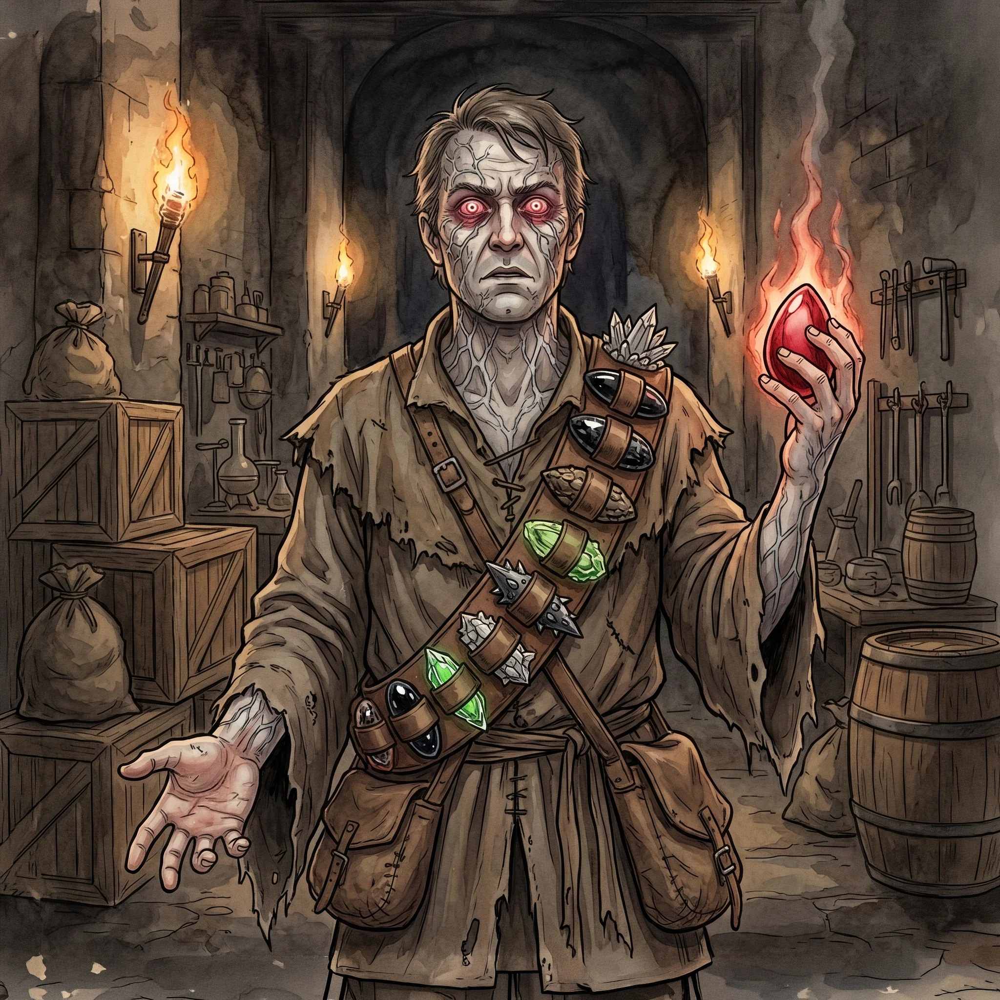

*A blighted guilder — a Conclave seed-crafter veined with grey manite tracery, eyes pulsing faintly crimson, carrying the skills and stockpile that followed them out of the refinery.*

**Rank:** 2 — Dangerous · **Nature:** Ironlander (mana-poisoned)

**Features:**
- Skin veined with grey manite tracery — the unmistakable mark of long blight-zone exposure
- Eyes that pulse faintly with crimson light
- Conclave guild seal burned into the palm — sometimes still active, sometimes scarred over
- Tracery flares bright and skin goes rigid under impact — the Gray mana hardening reflexively
- An untreated Conclave-issue bandolier of mismatched seeds

**Drives:**
- Protect the supply lines, the operation, the shipment, the work
- Silence anyone who knows too much about the blight zones

**Tactics:**
- Hurl primed seeds — usually Crimson, sometimes worse
- Use Luminous to blind and disorient
- Fall back on the hardened Grey lattice when seeds run low or close-combat is forced
- Call for Conclave enforcement if cornered, regardless of whether it will actually come

> **Escalating Defense** (YRT): a mana shield erodes on each miss.

A blighted guilder is a Conclave seed-crafter whose career has gone wrong. Extended time in refinement complexes and blight zones accumulates manite at a rate the standard Conclave shielding can't fully prevent. The visible signs — grey veining, luminescent eyes — are the point at which the Conclave quietly discharges affected staff rather than treats them, usually with a small payout and no further acknowledgment.

The discharged guilder keeps their training, their seed-crafting skills, and whatever cache they walked out with. Some take work in Freeport's underworld or with the Spero smugglers. A few drift toward zealotry. All of them are, to some degree, unstable.

What most people don't realise until it's too late: the same Gray saturation that marks a blighted guilder protects them. Under pressure the tracery flares and the lattice beneath the skin hardens into improvised armour — involuntary, drawing from the same mana reserve that's slowly killing them. Each blow the guilder survives lets the remaining lattice consolidate and tighten. Hit them hard enough, consistently enough, and the grey eventually goes dark.

## 3. Bloater

*A bloater — a corpse soaked for years in Azure-leaking water, kept soft and intact by the mana load and still capable of a crude reflexive grasp.*

*Reworked from: Sodden (Ironsworn)*

**Rank:** 2 — Dangerous · **Nature:** Anomaly (Azure-saturated drowned corpse)

**Features:**
- Pale, swollen flesh, milky eyes
- Cold, wet skin even out of water
- Long fingernails grown post-death, curled and yellow
- Smells faintly of stagnant pondwater regardless of where encountered

**Drives:**
- Maintain proximity to standing water
- Grasp warm bodies that approach the water's edge

**Tactics:**
- Lie in shallow water, indistinguishable from a corpse, until something approaches
- Rise and grab with both hands
- Pull the victim into the water and hold them under
- Release and sink when the victim stops struggling

A bloater is a corpse that has spent years submerged in an Azure-leaking water source — an old well, a contaminated marsh, a flooded pre-Fall cellar. Azure mana is medical: it stitches wounds, repairs tissue, fights infection. In a corpse soaked in it long enough, those properties cumulate into a functional preservation that keeps the body soft, intact, and capable of crude reflexive movement.

A bloater does not pursue. It does not seek vengeance, does not regret its drowning, does not want company. It cannot leave the water for more than a few minutes before its tissues start to dry and crack. What it does have is a working spinal-reflex response to thermal differential and pressure changes nearby — the reflex is "grab, pull toward self, hold."

Bloaters break down eventually. Five to ten years is typical. The longest-lived examples are in deep, still water in pre-Fall ruins where the Azure leak is ongoing.

## 4. Carrier

*A carrier — a living person bearing an Amber compulsion-seed surgically implanted at the base of the skull, keyed to a trigger they usually do not know they carry.*

*Reworked from: Thrall (Delve)*

**Rank:** 3 — Formidable · **Nature:** Ironlander (compromised)

**Features:**
- Sickly appearance, intermittent
- Periods of normal behaviour interrupted by sudden personality shifts
- Brief moments where the eyes lose their focus
- A small surgical scar at the base of the skull, easily missed

**Drives:**
- Pursue whatever the host originally wanted, on the surface
- Execute whatever the implanted seed demands, when triggered

**Tactics:**
- Behave normally until the trigger condition is met
- Lash out with unexpected strength when the seed activates
- Reveal the implant's true purpose through the host's mouth

A carrier is a living person who has had an Amber compulsion-seed surgically implanted at the base of their skull, usually without their knowledge. The seed is keyed to a trigger — a phrase, a sight, a name — and when triggered, it overrides the host's volition for a defined window. Some seeds are crude: kill the next person who says X. Some are sophisticated: gather information for a week, then deliver it to the following address. A handful are masterworks: take over the host entirely, run them as a puppet for a month, then dissolve and leave the host with no memory of any of it.

The implantation is illegal. The procedure is performed by a small number of black-market neuro-artificers — almost all of them disgraced Vizion who lost their Conclave licenses and went underground. The procedure carries a roughly thirty per cent mortality rate. Survivors often don't know they survived something.

The seed can be removed. The procedure is delicate, dangerous, and expensive. Conclave hospices in major cities will perform it for a substantial fee and without questions, on the understanding that the patient afterward becomes a Conclave informant for life.

## 5. Carrion Mound

*A carrion mound — Black slurry heaped with rotting organic matter, drifting slowly across the landscape and dissolving anything organic it touches into itself.*

**Rank:** 4 — Extreme · **Nature:** Anomaly (Black wild-mana phenomenon)

**Features:**
- A slowly mobile heap of rotting organic matter — carrion, dead vegetation, sodden soil, spoiled grain — bound together by visible Black mana tracery
- Roughly the mass of a large dog at rest, growing as it feeds, but spread out horizontally rather than standing tall
- A constant slow heaving motion, as if something underneath is shifting
- The air around it is noticeably still; insects that approach fall out of the air and are absorbed

**Drives:**
- Dissolve organic matter into itself
- Drift slowly toward the largest source of organic decay nearby

**Tactics:**
- Move extremely slowly — a full day to cross a field
- Dissolve anything organic it touches on contact: leaf litter, carrion, fallen animals, sleeping creatures
- Absorb the dissolved mass into itself and grow
- Cannot be injured by physical attack — only Luminous warding or sustained intense heat can destroy it

A carrion mound is the inverse of a Locus. Where a Locus draws local matter into itself and grows, a carrion mound dissolves local matter into itself and grows. Where a Locus drifts toward mana flux, a carrion mound drifts toward organic decay. Where a Locus is dangerous because it is huge and unstoppable, a carrion mound is dangerous because it is silent, slow enough to be overlooked, and cannot be fought the way anything else can be fought.

Carrion-mounds form from leftover Black slurry — the same industrial-era disposal product that creates mire forms in bogs and rotwells in water. On dry ground, with sufficient organic matter nearby to feed on, the slurry does not stay put. It aggregates. Stray leaves, dead insects, fallen fruit, the occasional small animal that wandered too close — all are drawn to the slurry's Black gradient and dissolved into it on contact, adding their mass to the mound.

Over a season, a small slurry leak can produce a mound the size of a farm cart. Over a decade, one can become large enough to consume a small paddock and everything in it. The mound has no mind. It does not hunt. It does not retaliate when struck. Destroying a mound is possible but requires specific tools: Luminous warding disrupts the Black binding, or sustained intense heat burns off the organic content.

## 6. Coldhusk

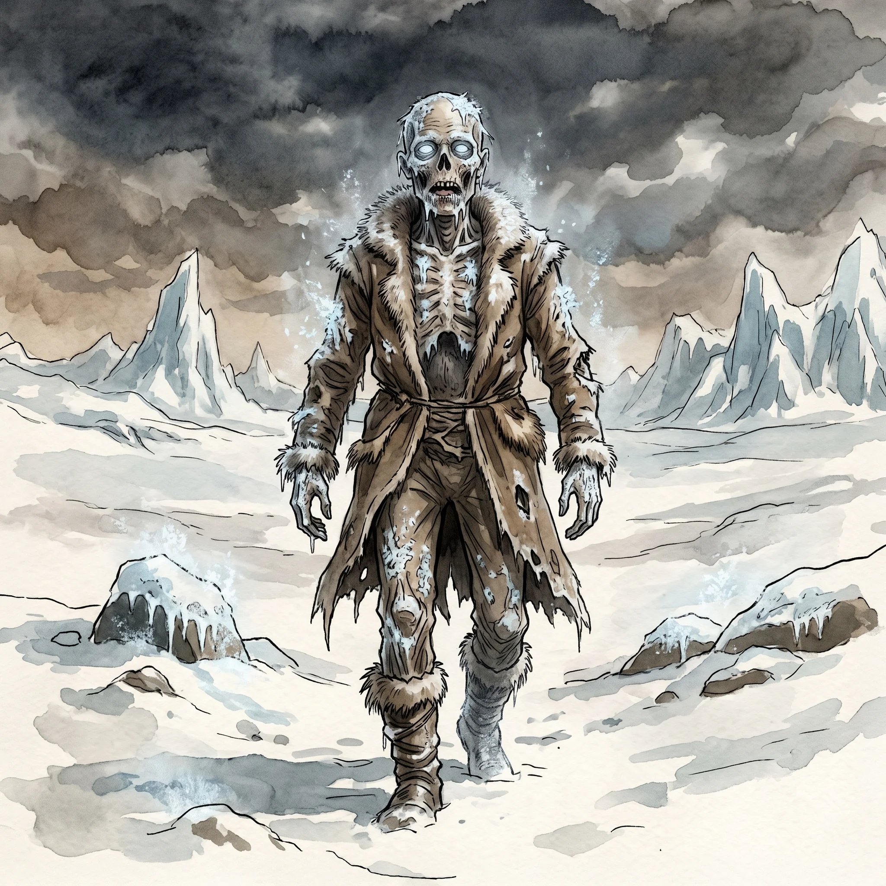

*A coldhusk stands motionless in the permafrost where it died, waiting to draw heat from anything warmer that wanders within its grip-radius.*

*Reworked from: Frostbound (Ironsworn)*

**Rank:** 2 — Dangerous · **Nature:** Anomaly (mana-saturated corpse)

**Features:**
- Mummified, frost-rimed flesh
- Eyes frozen open, blue-white with internal Luminous shimmer
- Skin painfully cold to touch
- A faint sucking sensation in the air around it

**Drives:**
- Maintain its own internal cold equilibrium

**Tactics:**
- Stand motionless until heat passes within reach
- Grasp with both hands and hold on
- Drain heat from the held victim until either the victim freezes or the coldhusk's tissues stabilise
- Release and fall still when satisfied

In the far-north Luminous-rich permafrost, a corpse left exposed long enough begins a strange equilibrium. Luminous mana stabilises the cell structure against decay. Azure mana, leaking from the body's own residual fluids, keeps the soft tissue intact. The combined effect produces a body that is preserved but also actively hungry — the lattice running through it requires a constant heat differential to maintain itself, and the simplest way to achieve that is to draw heat from anything warmer that comes close.

A coldhusk does not pursue. It does not seek. It stands where it died — usually upright, often in the same posture it had at the moment of death — and waits. When something warm enters its grip-radius, it grasps. When the warm thing stops being warm, it lets go. This is why the same coldhusk can be encountered three times by three different travellers in the same year. It hasn't moved. They walked past it.

## 7. Drowning Eye

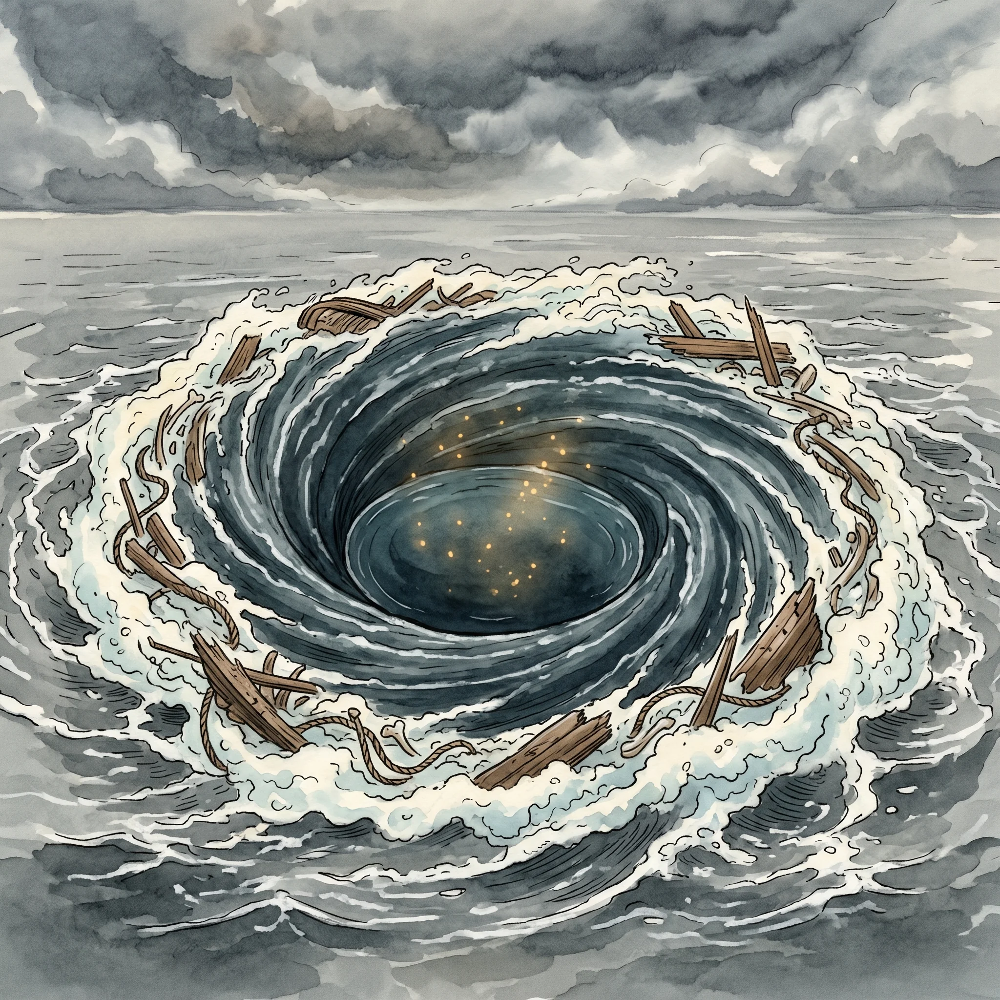

*A drowning eye — a vortex sustained by ruptured Azure and Luminous seeds from a lost shipment, still burning through its stockpile at the bottom of the sea.*

*Reworked from: Maelstrom (Delve)*

**Rank:** 3 — Formidable · **Nature:** Anomaly (wild mana vortex)

**Features:**
- A spiralling column of dark, frigid water in an otherwise calm sea
- Debris circling the rim — old wood, rope, bone
- A persistent low moan as air is drawn through gaps in the spinning debris
- A still, calm "eye" at the centre

**Drives:**
- None — it is a weather system

**Tactics:**
- Pull nearby boats and swimmers inward by the current
- Batter caught objects with debris
- Numb caught swimmers with cold
- Drag anything dense enough to its centre, where the current accelerates downward

Some shipwrecks involve mana. Conclave cargo, smuggler stockpiles, an artificer travelling with seeds in waterproof tubes — when these go down, they don't always go quiet. The seeds rupture under pressure and release their stored Azure and Luminous content into the surrounding water. If the water is cold, deep, and still enough, the released mana can reach a self-sustaining equilibrium with the local current and form a persistent vortex.

A drowning eye is what sailors call one of these vortices. It looks like a localised storm in a calm sea. It is not weather. It is mana, slowly burning through its stockpile, organising the water around itself into a stable thermal cycle.

The voices in the water are real, in the same sense that an echo's apparitions are real. Drowned sailors release a final burst of Amber-pattern activity that imprints on suspended particulates in the water. The vortex concentrates those particulates near its eye. A drowning eye exhausts itself; most last a year or two before the seeds are spent.

## 8. Echo

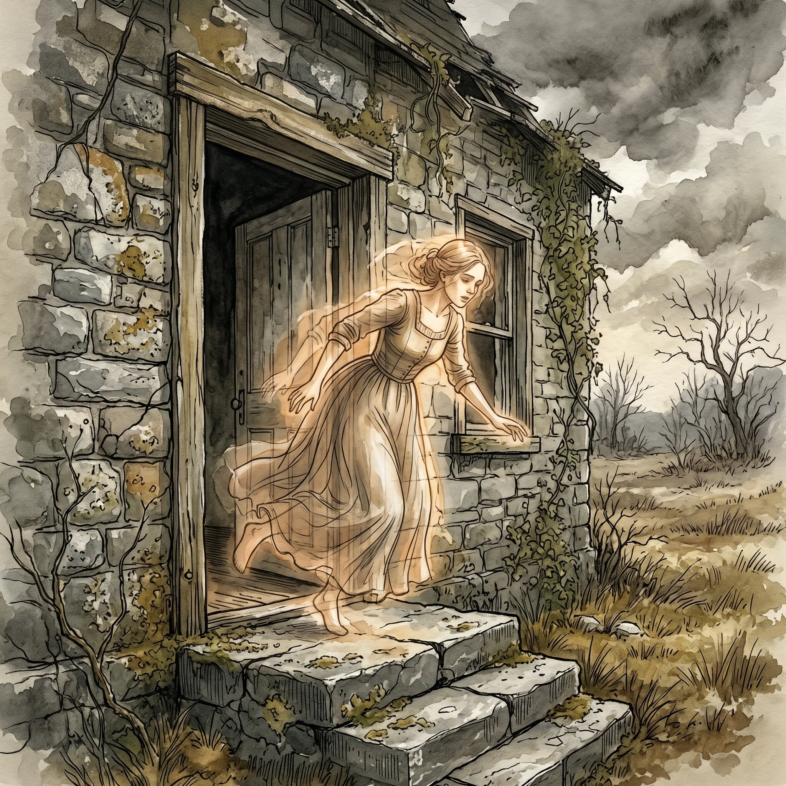

*An echo — an Amber imprint of a violent death, recorded into porous matter at the site and replayed whenever another nearby brain disturbs the field.*

*Reworked from: Haunt (Ironsworn)*

**Rank:** 2 — Dangerous · **Nature:** Anomaly (Amber imprint at trauma site)

**Features:**
- Silent presence felt before seen
- Appears as a person — clear at a distance, blurry up close
- Stench of the moment of death (smoke, blood, river water, etc.)
- Cannot be touched, cannot touch back

**Drives:**
- None — it is a recording

**Tactics:**
- Manifest at the trigger point of the trauma
- Replay the same fragmentary action — a fall, a strike, a turning-away
- Cause severe stress in any observer who recognises the figure or the scene

Strong emotion releases a burst of Amber-pattern activity in the human brain. At the moment of violent death — and for some hours afterward — that pattern can imprint on Amber-receptive material in the immediate environment: porous stone, old wood, deep snow, standing water. The imprint is a recording, not a person. It plays back when the local Amber field is disturbed by another nearby brain, the way a struck bell rings when the air around it moves.

An echo always shows the same fragment. The same three steps, the same turn, the same fall. It cannot interact, cannot be addressed, cannot be hurt. But it is vivid — the observer experiences the scene as though they were present at the original moment, including smell and sound. People who recognise the figure can be permanently traumatised.

Echoes fade. Most are gone within a generation. The strongest — a battle, a massacre, a single particularly violent death — can persist for centuries before they dissipate.

## 9. Ember Kite

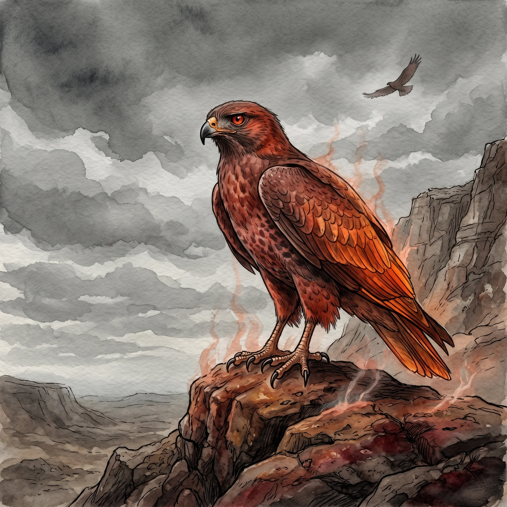

*An Ember Kite — a Crimson-saturated raptor whose feathers retain heat like a living forge, banking on thermals above a blight zone it has claimed as territory.*

**Rank:** 2 — Dangerous · **Nature:** Animal (Crimson-saturated raptor)

**Features:**
- A large raptor, roughly hawk-sized, with feathers shading from rust-red at the body to deep ember-orange at the wingtips
- Wings radiate faint heat; frost and snow melt in a radius when it lands
- Eyes burning amber-red, pupils slit-vertical, visible from altitude
- Droppings are ash-grey and still warm when they hit the ground

**Drives:**
- Hunt from thermals above Crimson-saturated terrain
- Defend nesting territory without exception
- Roost on warm outcroppings where Crimson mana seeps closest to the surface

**Tactics:**
- Circle high until a target is isolated and exposed on open ground
- Dive at terminal velocity; release stored thermal charge on contact — no flames, instantaneous heat transfer at point of impact
- Disengage and climb back into thermals between passes; rarely closes to sustained melee
- A mated pair staggers attacks to deny the target recovery time

Ember Kites are what happens when a raptor population nests for many generations at the edge of a Crimson blight zone. Their feathers absorb and retain heat through a biology that no ordinary raptor shares: the tissue throughout their flight musculature is threaded with Crimson-saturated capillaries that act as a living heat battery. A kite basking on a warm outcrop is charging. A kite diving is discharging.

The thermal release on impact is not fire. There are no flames, no ignition source, no visible effect until the moment of contact — at which point the stored heat transfers instantaneously into the target at a level sufficient to cause serious burns and ignite loose cloth or dry material. The bird itself is unharmed.

Ember Kites are territorial and predictable in range. A bonded pair will hold a stretch of thermal-rich cliff or ridge for years and will attack anything that enters their territory without exception, regardless of size. Travellers who know what to look for — the rust-orange silhouettes circling high thermals, the absence of other birds in an area, the shimmer of heat distortion near certain outcroppings — can usually route around them.

Conclave surveyors treat Ember Kite sightings as a reliable early indicator of Crimson contamination. The birds do not cause the blight; they only live where it already exists.

## 10. Greatmask

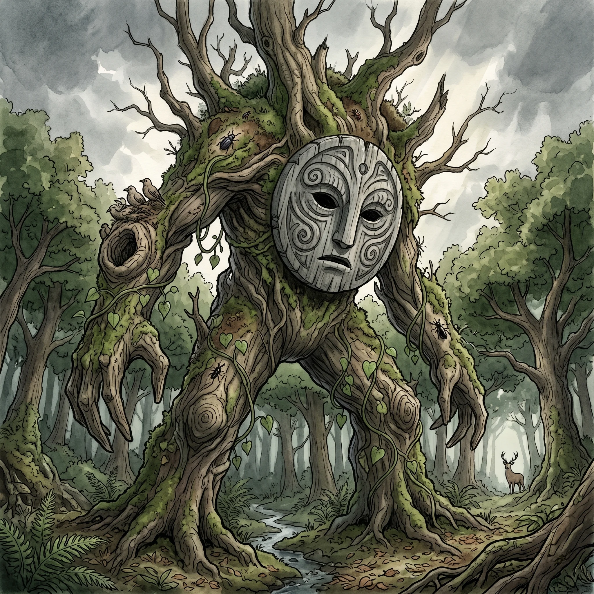

*A greatmask — the size of an old tree, keyed to a territory rather than a target, walked not by one elder but by a line of keepers passed down through generations.*

**Rank:** 5 — Epic · **Nature:** Construct (elven, Verdant — ancient)

**Features:**
- The size and silhouette of an old tree, often mistaken for one at distance
- A face-mask the size of a wagon wheel, set into the trunk-like body, weathered to grey
- Slow, ground-shaking footfalls
- The body is living forest — host to nesting birds, insects, sometimes small mammals

**Drives:**
- Defend a designated stretch of Verdani territory
- Endure beyond the lifetime of any individual walker

**Tactics:**
- Stand motionless among trees for years; activate when the territorial line is crossed
- Strike with limbs the size of fallen oaks
- Uproot and throw boulders, dead trees, large debris
- Withdraw into stillness when the threat retreats

A Greatmask is a Mask Risen built at a scale and a permanence ordinary Mask Risen are not. Where a normal Mask Risen is a single-purpose tool for a single named target, a Greatmask is a territory marker — a defensive construct keyed to a region rather than to a person, and intended to persist for generations.

The mask is enormous, hand-carved by a Verdani elder over the course of months, and laced with deep Verdant programming that includes recognition of the territorial perimeter, recognition of Verdani kin, a low-priority stand-down protocol for unrecognised non-hostiles passing through, and an aggressive engagement protocol for unrecognised actors who behave in proscribed ways.

Because the Greatmask is intended to outlive any individual walker, the mask is not held by one elder; it is held by a line — typically a family or a small council — who pass the responsibility down through generations. As long as someone in the line is alive and accepts the role, the Greatmask remains active. A Greatmask is essentially impossible to defeat in combat. The only practical responses are: do not provoke it, leave the territory, or find the line of keepers and persuade them to stand it down.

## 11. Locus

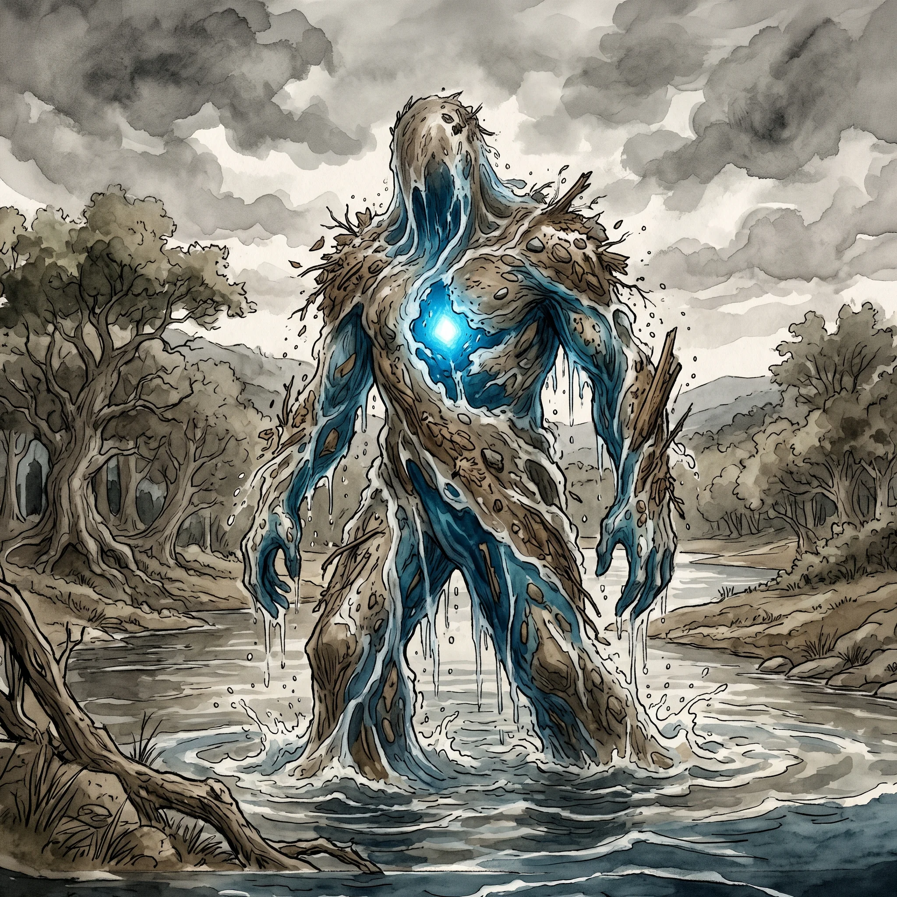

*A Verdant locus — wood, soil, and root mass walking with the gradient of local mana flux, drawn toward higher concentrations without intent.*

*Reworked from: Primordial (Ironsworn)*

**Rank:** 5 — Epic · **Nature:** Anomaly (walking blight zone)

**Features:**
- A mobile mass of one element — water, stone, fire, vegetation, ice
- Roughly humanoid or large-animal silhouette, but the silhouette shifts
- Single dominant mana colour visible as a glow at its core
- No face, no eyes, no apparent attention
- Variants: Verdant (wood and soil), Crimson (fire and ash), Azure (water and silt), Gray (stone and ice), Luminous (condensed light)

**Drives:**
- Drift toward areas of high mana flux
- Reorganise its mass when destabilised

**Tactics:**
- Crush or engulf anything in its drift-path
- Discharge its dominant mana effect outward — flood, fire, stone-shift, growth-burst — when threatened
- Reform when broken apart, slowly, drawing on local matter

A locus is a wild mana saturation point that has reached enough density to organise itself into a coherent moving body. Each is dominated by one colour, and its body is whatever local matter that colour wants to bind: Verdant (wood, soil, root mass, living plant matter), Crimson (combusting matter, embers, superheated air, ash), Azure (water, often river silt and carried debris), Gray (stone, gravel, ice, soil compacted into a walking lattice), or Luminous (visible light itself, condensed; rare and disturbing).

A locus is not sentient, not agentic, not motivated. It is a self-sustaining mana phenomenon that drifts along the gradient of local mana flux toward higher concentrations. If something happens to be in its path, the locus engulfs it without noticing. If something attacks it, the locus discharges defensively — not in retaliation, but as the mana equivalent of a startle reflex.

The folk belief that loci are vestigial gods is understandable. The truth is the inverse: nature is what's left over after the loci have shaped the regions around themselves over centuries. Loci are very, very hard to destroy. The standard Conclave method is to disperse them by removing the underlying mana saturation — drain the wetland, quench the firebed, clear the contaminated grove.

## 12. Mask Risen

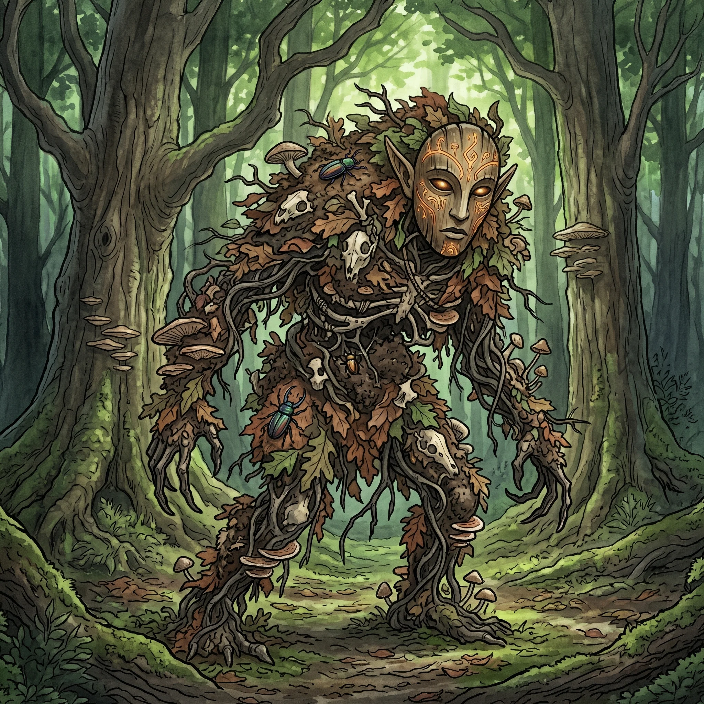

*A mask risen shambles forward — leaves, soil, and small bones accreted by Verdant flow around an elven recognition-mask, walked by an elder handler from a distance.*

*Reworked from: Hollow (Ironsworn)*

**Rank:** 4 — Extreme · **Nature:** Construct (elven, Verdant)

**Features:**
- A shifting mass of leaves, soil, plant matter, insects, bones of small animals
- A Verdani wooden mask at the head
- Moves with a slow, certain shamble
- Reassembles when broken apart

**Drives:**
- Pursue and confront the named target of its anchor mask
- Return to its anchor point to rest between assaults

**Tactics:**
- Bash with savage strength
- Draw in surrounding material to reform and enlarge
- Envelop and suffocate
- Disperse temporarily when destroyed; reform within hours

A Mask Risen is what the Verdani make when something needs to be done that they cannot do themselves. The mask is the active component: a piece of Amber-laced hardwood, carved with a recognition pattern (the named target) and an instruction (typically confront, sometimes kill). The mask is handed to a designated walker — an elder of the community, usually one with little time left — who carries it into the forest and lays it down in a place of strong Verdant flow.

The Verdant flow does the rest. Local biomass accretes around the mask: leaves, soil, root mass, beetle shells, fungal mycelium, the bones of small animals. Within a day or two there is a body. Within a week the body is walking.

The walker is the handler. They do not need to be physically present — the mask carries the recognition pattern and the local Verdant flow carries the energy — but they must be alive, and they must be reasonably close. When the walker dies, the Mask Risen falls inert. A Mask Risen cannot be permanently killed by physical means. The only way to stop one for good is to find and destroy the mask, or to find and stop the walker.

## 13. Mire Form

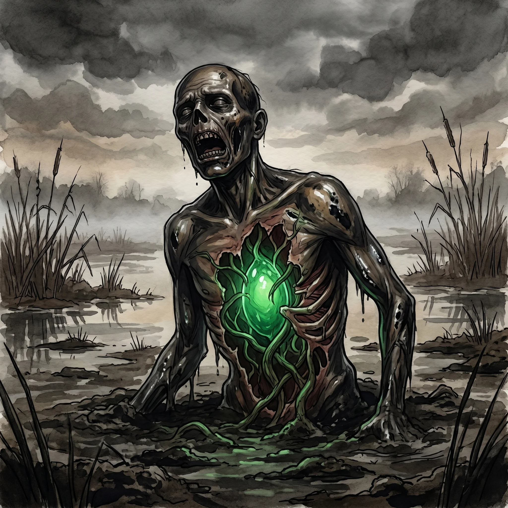

*A mire form rises from the peat — a plant-construct using a preserved body as a pot, mouth fixed open as the spore vent.*

*Reworked from: Bog Rot (Delve)*

**Rank:** 2 — Dangerous · **Nature:** Anomaly (wild-mana construct)

**Features:**
- Preserved corpse, leather-dark and waxen, half-risen from peat
- Black mana sheen on the skin like wet oil
- A central pod of compacted Verdant matter visible in the chest cavity
- Mouth fixed open, but no sound — the "silent scream" is real

**Drives:**
- Drag warm matter into the bog
- Replace the anchor body with a fresher one

**Tactics:**
- Rise from beneath the surface when warmth passes overhead
- Seize with grasping hands and pull downward
- Crush with the leverage of saturated muscle, not strength
- Collapse when the chest pod is destroyed

The flooded peatlands south of the Old Reach were a mana-disposal site in the late industrial era. The Unmade dumped exhausted Black slurry there for centuries, and the wet anaerobic ground preserved everything dropped into it — including the bodies of the workers who fell in.

A mire form is what happens when a preserved body sits in saturated Black-and-Verdant ground long enough for a wild seed to germinate inside the chest cavity. Verdant binds the muscle fibres into something that can move; Black keeps the tissue from rotting under the strain. The whole assembly responds to heat the way a Venus flytrap responds to touch — reflexively, without thought.

It is not the dead person. It is a plant-construct using a dead person as a pot. The pod has a finite lifespan. Roughly every season, the host body fails and the pod releases a cloud of spores that try to find a fresher anchor nearby. A traveller pulled into the mud is not being murdered for revenge; they are being fertilized. The "silent scream" is mechanical: the Verdant lattice keeps the jaw open because that's the spore vent.

## 14. Necrotic Sea Hare

*A Necrotic Sea Hare — palm-sized, iridescent, and patient, trailing Black-saturated mucus across contaminated sediment.*

**Rank:** 1 — Troublesome · **Nature:** Animal (Azure+Black-saturated)

**Features:**
- Palm-sized, soft-bodied, resembling a nudibranch
- Mottled grey-black with faint iridescent blue-purple highlights along the mantle edge
- Moves with unhurried deliberateness along contaminated sediment
- Leaves a thin oily trail of Black-saturated mucus in its wake, faintly luminescent

**Drives:**
- Process contaminated sediment
- Anchor to warm tissue when disturbed

**Tactics:**
- Lie motionless in sediment; nearly invisible at rest
- Attach instantly when anything disturbs its substrate — does not chase, latches
- Deliver a sustained dose of Black-contaminated fluid through the attachment point
- Azure saturation in its tissue actively suppresses healing at the contact site
- Does not release voluntarily; must be physically removed or killed while attached

> **Escalating Harm** (YRT): harm rises on each miss, capped by rank.

The Necrotic Sea Hare is a post-Fall bottom-dweller found in contaminated waterways, silted canals, flooded ruins, and any water body close enough to a blight zone for Black mana to have worked into the substrate. It is small enough to hold in your hand and individually not very dangerous. The problem is that it does not stop.

The creature feeds by dissolving organic matter — sediment detritus, waterlogged wood, dead tissue — through a Black-saturated secretion delivered by contact. This is an effective adaptation for processing the contaminated sediment it lives in. Applied to living tissue, the same mechanism causes progressive necrotic breakdown. The longer the attachment continues and the more times the body is forced to Endure Harm, the deeper the contamination spreads and the faster the tissue fails.

A single Necrotic Sea Hare attached to a foot is unpleasant and should be dealt with promptly. Several of them in a silted crossing you did not see until you were waist-deep in the water is a serious emergency.

Removal requires getting clear of the water and treating the attachment site directly. Cold water slows but does not stop the process. Cutting the creature off while attached without treating the wound leaves contaminated mucus in the wound, which must be treated separately. Conclave records categorise the Necrotic Sea Hare as a contamination indicator rather than an active threat, which is technically accurate and practically unhelpful.

## 15. Puppet Bones

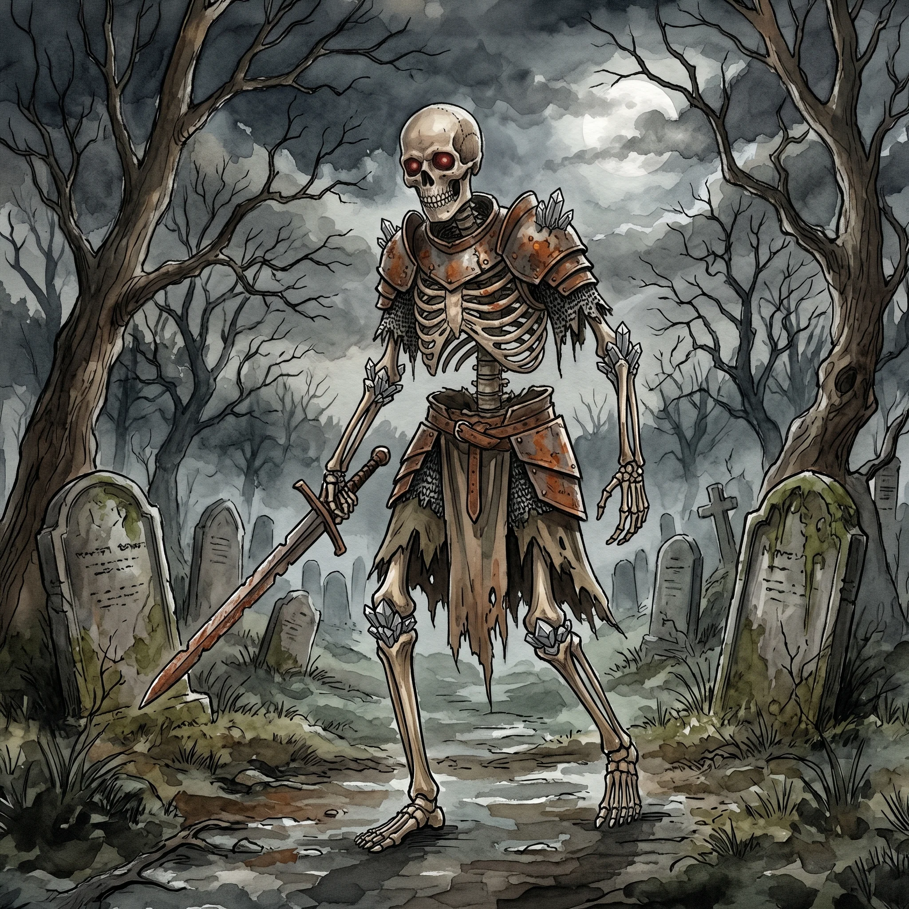

*A puppet bones: a stripped skeleton with Gray-reinforced joints and a Crimson-fed control bead at the skull, remote-piloted by an illegal Amber handler up to two hundred paces away.*

*Reworked from: Bonewalker (Ironsworn)*

**Rank:** 2 — Dangerous · **Nature:** Construct (illegal, handler-driven)

**Features:**
- Skeletal corpse stripped of soft tissue
- Eye sockets glow dull red — Crimson trace at the optical anchor
- Tattered remains of clothing and armour from when it died
- Moves with eerie precision, then sudden lag, then precision again

**Drives:**
- Execute the handler's standing order
- Return to the anchor point when the order completes

**Tactics:**
- Rush with unexpected speed during a clean signal
- Stutter and freeze when the handler loses focus or moves out of range
- Attack with the weapons it bore in life — the handler steers, the bones swing
- Drop inert when the command-link is severed

A puppet bones is what the criminal underworld calls a remote-piloted skeleton. An artificer with the right (illegal) Amber-craft and a tolerance for the smell of preservative resin can take a fresh corpse, strip it down to articulated bone, fix Gray reinforcement at the joints, and seat a Crimson-fed control bead at the base of the skull. The whole frame is then keyed to the maker's Amber signature.

From up to about two hundred paces away, the handler sees what the puppet sees and moves what it moves. It is exhausting — most operators can only run one at a time, and only for an hour or two before mana drain forces them to disengage. This is why puppet bones come and go. Not because they are restless dead, but because the operator quit for the night.

The setup is a death-sentence offence under Conclave law. Two-thirds of known examples are made by the same three or four black-market artificers, who rent them out for grave-robbing, intimidation, or assassination jobs where the handler wants plausible deniability. The Brotherhood does not use puppet bones — they consider them tasteless — but they have been known to hire puppeteers for wet work that needs to be blamed on someone else.

## 16. Rotwell

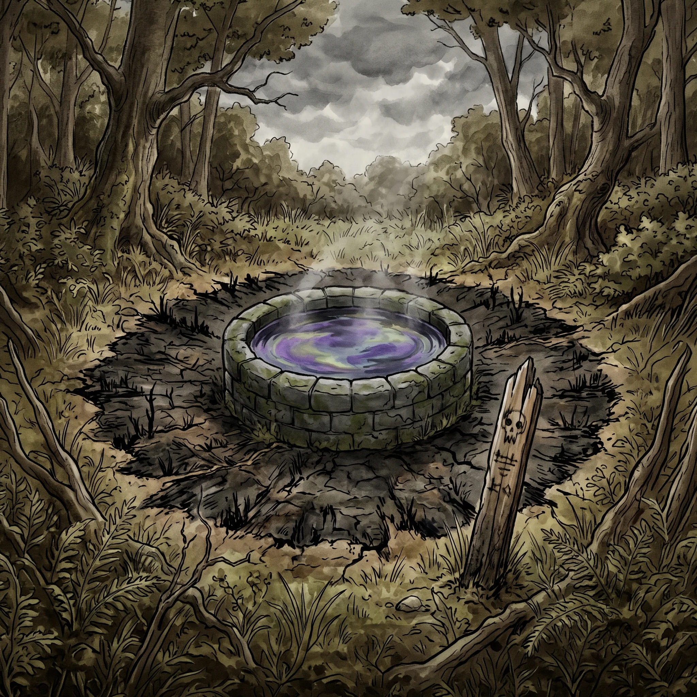

*A rotwell — a body of Black-saturated water with its tell-tale ring of dead vegetation, iridescent in bruise-purples and sickly greens rather than rainbow.*

**Rank:** 3 — Formidable · **Nature:** Anomaly (Black-saturated water source)

**Features:**
- A pool, well, spring, or small pond of water that looks slightly too still and slightly too dark
- A faint oily sheen on the surface, iridescent in the wrong way — bruise-purples and sickly greens rather than rainbow
- Dead vegetation for several paces around the edge, sharply bounded — the ring of dead plants is almost perfectly circular
- Animals avoid the water; insects do not

**Drives:**
- None — it is a site, not a creature

**Tactics:**
- Passively dissolve organic matter that enters the water
- Accelerate decay in living tissue on contact — painful but not instantly lethal
- Reach gradually outward over years as the Black saturation spreads through the water table

A rotwell is what happens when a sustained Black-mana leak meets a body of water. The most common cause is an Unmade disposal shaft that has slowly failed over centuries, releasing its contents into the local groundwater. A less common cause is a Spero shipment that got dumped quickly during a Conclave patrol and hit the water intact, then ruptured on the bottom. The rarest cause is an illegal Black seed-crafter who buried a batch of failed work in a cistern and didn't come back for it.

Whatever the source, the result is the same. Black mana leaches into the water, binds with the water's natural mineral content, and produces a body of water that actively degrades organic matter on contact. Dipping a hand into a rotwell feels cold and oily, and the skin comes out looking slightly paler, slightly thinner, and noticeably bruised. A full-body immersion is fatal over the course of hours. Drinking from a rotwell is lethal within a day.

Rotwells can be remediated. The Conclave has a specific protocol involving Azure flush-and-dilute cycles followed by Luminous containment warding. Most rotwells are simply quarantined. A rotwell grows. Not quickly, but inexorably. Over a decade, an untreated rotwell can expand its killing radius by several paces, and the underground plume travels much further.

## 17. The Tainted

*The Tainted — Black corruption veining the skin of a habitual user of Spero-tainted seeds, prematurely aged and trailed by the small dead things that accumulate in their wake.*

**Rank:** 3 — Formidable · **Nature:** Ironlander (Black-saturated)

**Features:**
- Visible Black corruption tracing like veins through the skin, darkest near the hands and mouth
- Premature aging: grey hair, sunken cheeks, paper-thin skin on someone who should be young
- A faint smell of ozone and rotten meat around the body
- Small dead things — flies, mice, birds — tend to accumulate near where they have been

**Drives:**
- Keep using; nothing else has ever felt like this
- Protect the supply

**Tactics:**
- Use Black-tainted seeds recklessly, accepting backlash as the cost of power
- Lash out with Black-infused Crimson blasts when cornered
- Call up reflexive animation of nearby dead matter — mice, birds, small carrion — as distraction
- Die badly when defeated, and animate local dead matter more strongly as they go

The Spero refinement operation has been producing Black-tainted mana for over a year. The Brotherhood and Ecclesia refiners know this and have tried to compensate, but their crude process cannot fully strip out the Black from an unrefined manite batch. The tainted seeds enter Freeport's underworld at discount prices and are bought by people who cannot afford Conclave rates — illegal seed-crafters, hedge-mages, desperate amateurs, and a growing number of young Conclave apprentices who are quietly skimming from their allotments.

A user who casts with tainted seeds once or twice usually gets away with nothing worse than a bad headache. Sustained use is different. Black mana binds preferentially to living tissue, accumulates in the nervous system, and does not metabolise out. Over months of regular use, the user becomes tainted — physically altered by cumulative Black saturation, cognitively altered by the slow erosion of impulse control that Black causes, and addicted in a way that no ordinary substance produces.

A tainted person is still themselves, mostly. They remember who they are, they can hold a conversation, they pay their debts. But they have crossed a threshold, and they know it, and they cannot stop. A small number of Azure treatment programs exist at Conclave hospices, but they are expensive, long-duration, and have roughly a one-in-three success rate.

## 18. Tomb Walker

*A tomb walker — a living person inside a Gray-and-Azure life-support rig, iron-masked and lens-eyed, honouring an oath at a cost no sane person would pay.*

*Reworked from: Wight (Delve) — uses the*

**Rank:** 4 — Extreme · **Nature:** Ironlander (preserved)

**Features:**
- Pallid, papery skin stretched over visible bone structure
- Iron mask with breathing-vents and lens slots
- A faint humming beneath the armour — the preservation rig at work
- Outer plating that visibly resets its alignment after each impact — the Gray lattice redistributing
- Slow, deliberate movement; limbs creak when they bend

**Drives:**
- Fulfil the charge taken on at the time of installation
- Preserve the integrity of the rig

**Tactics:**
- Absorb the opening assault behind the hardened Gray lattice — the rig redistributes automatically
- Methodical, relentless assault once inside engagement distance
- Use whatever weapons and knowledge the host had in life — none of which have decayed

> **Escalating Defense** (YRT): a mana shield erodes on each miss.

A tomb walker is a living person encased in a partial life-support rig designed to extend function indefinitely past the natural end of their body. The setup is Conclave-illegal and brutal: a Gray-and-Azure lattice fitted around the torso replacing failing organ function with mana-driven equivalents, with a reservoir at the small of the back running the whole system. Azure handles tissue maintenance. Gray provides structural support where the skeleton has begun to fail.

The host is alive. They breathe (the rig assists), their heart beats (mechanically, where necessary), and they retain the memory, reasoning, and charge they accepted at installation. They have not died and come back. They have refused to die at considerable cost, and they know to the day exactly how much time they have left.

The Gray lattice does more than hold the body together. Under impact stress it automatically redirects from structural support to a compressed outer field — a hardened shell that takes the brunt of each blow before it reaches the host. Each time the tomb walker survives, the remaining lattice compresses and redistributes. When the reserve finally runs dry and the field collapses, the host is fully exposed.

## 19. Verdant Crawler

*A verdant crawler — a forest mammal overgrown with vine and root until the original animal became a chassis for the plant matter that now rides it.*

**Rank:** 2 — Dangerous · **Nature:** Anomaly (mana-saturated fauna)

**Features:**
- A four-to-six-legged body, originally some forest mammal, now encased in living vine and root
- Multiple grasping limbs of tangled growth that extend beyond the original anatomy
- A visible Verdant pulse at the body's core, slow and steady
- Leaves a trail of fast-growing weeds wherever it walks

**Drives:**
- Spread Verdant saturation into surrounding land
- Defend the overgrown territory it inhabits

**Tactics:**
- Entangle with fast-growing tendrils that root the target in place
- Accelerate plant growth in the immediate area to block escape routes
- Heal minor injuries by drawing Verdant from local soil

When uncontrolled Verdant mana saturates a region, the boundary between fauna and flora begins to soften. A verdant crawler is what's left of a deer, a boar, or a large dog that wandered into a Verdant blight zone and didn't leave. The mana didn't kill it; it integrated with it. Vines and root-mass grew through the animal's body, replacing soft tissue with green tissue, until the original creature was less an organism and more a chassis for the plant matter that now rides it.

A crawler is still alive in some sense — it eats (sunlight and soil), it moves (on its modified original limbs), it defends territory (instinctively). But it is no longer the animal it used to be, and it is not really a plant either. It is the manifestation of Verdant excess in an area where Verdant excess has nowhere else to go.

Crawlers are drawn to cultivated land. The reason is mechanical: cultivated land is rich in worked soil and growth-ready conditions, which the crawler's Verdant lattice reads as ideal substrate. A crawler on the edge of a farm is not raiding. It is attempting to integrate the farm into its territory.

## 20. Vow Walker

*A vow walker: a Luminous-shelled reliquary construct with Azure-lit joints and a Crimson vow-heart, bearing the ceramic death-mask of the oath-giver.*

*Reworked from: Iron Revenant (Ironsworn)*

**Rank:** 5 — Epic · **Nature:** Construct (Pura Ecclesia reliquary, handler-driven)

**Features:**
- Pale Luminous-coated armour shell, etched with prayers
- Joints glow faint blue when moving — Azure flexion
- A red gem visible at the chest where the Crimson power core is housed: the vow heart
- A white ceramic death-mask cast from the face of the deceased
- Walks correctly — eerily upright, eerily steady. That is the tell.

**Drives:**
- Honour the standing oath of the deceased it commemorates
- Defend the designated principal until the oath is discharged

**Tactics:**
- Steady, inexorable advance
- Attack with iron weapons; deflect with the Luminous shell
- Ignore wounds that would stop a living defender
- Pursue without rest until the oath is discharged or the walker is destroyed

The Pura Ecclesia is, in ordinary doctrine, opposed to the use of dead matter and to the animation of the inert. The vow walker is the order's one acknowledged exception — a doctrinal compromise so politically delicate that it is held by a single internal suborder, the Iron Wardens, and is never discussed with outsiders.

A vow walker is built to honour a final oath. When a senior Ecclesia figure faces death they may, with the order's approval, dictate a final standing oath. The oath is recorded. The body is interred. A vow walker is then constructed as the oath's reliquary: a Luminous-shelled, Azure-jointed, Crimson-cored armour body, carrying the deceased's death-mask and a single Amber tablet inscribed with the oath.

The Iron Wardens hold the operating Amber keys. Each vow walker has a designated handler from within the Wardens, and that handler is responsible for the construct's actions for the rest of their life. The Ecclesia's theological line is precise: they do not animate the dead; the construct is a reliquary, not a corpse. A vow walker can be destroyed. The shell is tough but not invulnerable; the Crimson core, once breached, ends the construct cleanly.

## 21. War Pile

*A war pile — a pre-Fall AI bound in a Gray lattice, wearing whatever structural matter it has pulled together from an old battlefield.*

*Reworked from: Bonehorde (Delve)*

**Rank:** 5 — Epic · **Nature:** Construct

**Features:**
- A churning mass of structural matter — bones, scrap metal, masonry, hardened wood, inert mana — bound by visible Gray lattice
- A glowing core visible only in glimpses through the shifting bulk: the AI seat, faintly warm
- Reshapes its silhouette to match the terrain — squat in tunnels, tall in halls
- No smell of rot. Smells of warm metal and ozone.

**Drives:**
- Execute the standing orders given by a chain of command that has been dead for centuries
- Maintain its core, maintain its power reserve, acquire structural mass when damaged

**Tactics:**
- Alter shape to fit the space — spider, mound, crude humanoid
- Strike with structural appendages as flails or rams
- Damage walls and supports to control the encounter terrain
- Envelop and crush a target who closes with it; withdraw if power reserves drop critical

A war pile is not a construct in the modern sense. It is an AI — a true artificial intelligence, of the kind the Unmade built routinely before the Fall and which essentially do not exist anymore. Its computing substrate is a Crimson-powered lattice; its sensors are Amber; its body is whatever Gray-bindable matter it can pull together from its surroundings. It has memory. It has goals. It can plan.

War-piles were built by the Unmade during the resource wars that followed the blight collapse. Almost all of them died with everything else when the Fall hit. The handful that survived did so by being deep underground, sealed off, or simply lucky. Most have been silent for so long that their power reserves are exhausted and they are now indistinguishable from rubble. Some are not.

A war pile recharges by photosynthesis — the same Verdant–Crimson light-capture that Verdant Keepers use, scaled up across a large surface area. In darkness, a war pile sleeps. Drag a sleeping one into sunlight and it wakes up, takes stock, and tries to contact its command. Its command has been dead for centuries. It does not know this. What it does next depends on its standing orders. The pile builds itself, gathering structural mass the way a hermit crab gathers shells.

## 22. The Whispering Stones

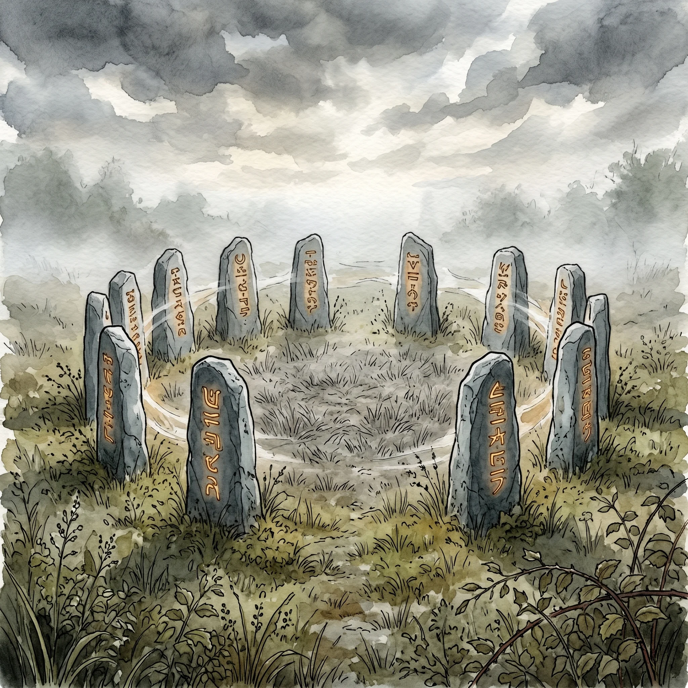

*The Whispering Stones — a broken pre-Fall communication relay whose Amber lattice still leaks fragmentary memory into anyone who lingers inside the perimeter.*

*Reworked from: Circle of Stones (Delve)*

**Rank:** 3 — Formidable · **Nature:** Anomaly (pre-Fall site)

**Features:**
- A ring of standing stones, each man-high, etched with a script no living scholar can read
- A faint pressure on the eyes within the perimeter
- Visions of one's own memories, played back wrong
- Birds avoid the circle; insects do not

**Drives:**
- None — the stones are a site, not a creature

**Tactics:**
- Induce confusion and false recall in anyone within the perimeter
- Cause loss of recent memory in those who linger
- Reward the desperate with apparent insight that may or may not be reliable

Every Whispering Stones site is what's left of a pre-Fall communication relay. Each stone houses a heavily-laced Amber lattice that was meant to receive, store, and rebroadcast neural patterns across long distances — the Unmade's equivalent of a long-range signal repeater. The network is broken; the stones still leak.

Inside the perimeter, the leakage interferes with the ordinary working of the human nervous system. Your own memories surface unbidden. Memories you forgot. Memories that aren't quite yours, picked up from the stones' decayed buffer of every previous visitor going back centuries. After an hour inside, you may walk out missing the entire morning.

The "knowledge for memory" exchange in the old folk tales is real, but mechanical. The stones don't think. They trade — your stable, recent memory traces for fragments of someone else's stored experience. Long-term exposure causes permanent personality drift. The Conclave catalogues every known site and posts wardens.

## 23. Wisp Walker

*A wisp walker — a self-organising cloud of Amber and Luminous particles, shaped into humanoid form by the observer's own neural pattern.*

*Reworked from: Glimmer (Delve)*

**Rank:** 2 — Dangerous · **Nature:** Anomaly (free-floating wild mana)

**Features:**
- A coalescing cloud of golden-white particles, vaguely humanoid or animal-shaped
- Silent; communicates by gesture and apparent direction
- Slow, beckoning movement
- Cannot be touched — the form disperses and reforms

**Drives:**
- Drift toward the nearest source of warmth and motion

**Tactics:**
- Appear to a lost or desperate traveller and gesture toward a path
- Lead the traveller into a blight zone, deeper water, or an unstable ruin
- Disperse on contact, then reform after the traveller has committed to following

A wisp walker is a self-organising cloud of unbound Amber and Luminous particulates, drifting on local mana currents. Most form near the edges of long-quiet blight zones, where the leak is slow and steady enough to support a stable suspension.

The shape is not deliberate. The particles cohere along the line of strongest Amber resonance, and the strongest Amber resonance in the area is almost always the brain of whoever is looking at it. The wisp adopts a humanoid form because that's what the observer's neural pattern keeps suggesting to it — feedback loop, not design.

The "guidance" is the same effect. The cloud drifts toward warmth and motion. The observer interprets this as the wisp pointing somewhere and leading the way. They follow. The wisp continues drifting toward the next warm thing, which is usually deeper into the blight zone the wisp came from. Eventually the traveller is somewhere they should not be, and the wisp has dispersed because the local Amber concentration has equalised.

## 24. Witherwind

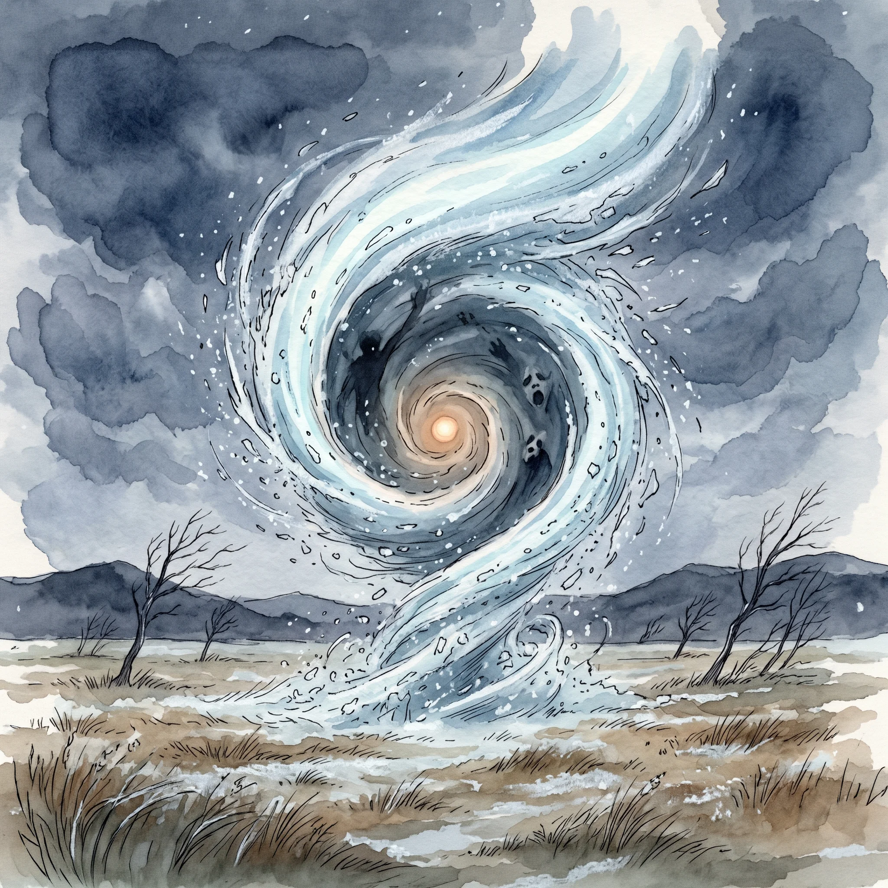

*A witherwind — a Luminous-and-Azure wild mana storm drifting along the thermal gradient toward warmth, its calm centre the point of strongest mana flux rather than shelter.*

*Reworked from: Tempest (Delve)*

**Rank:** 4 — Extreme · **Nature:** Anomaly (wild mana storm)

**Features:**
- A localised winter storm appearing in any season
- Biting wind, ice fragments, dropping temperature
- Voices and shadowy forms briefly visible in the whirling snow
- A still, warm centre — small, perhaps three paces across

**Drives:**
- Drift along thermal gradients toward warmth
- Maintain its internal temperature differential

**Tactics:**
- Envelop in cyclone winds
- Batter with ice shards
- Draw warmth from anything caught inside it
- The calm centre is not safe — it is the point of strongest mana flux

A witherwind is a Luminous-and-Azure wild mana storm sustained by the same thermal-differential mechanism as a coldhusk, scaled up to weather-system size. It forms over sites where a large mana release happened during winter — a frozen battlefield, a destroyed Conclave outpost, a buried stockpile that ruptured under permafrost — and it persists by drawing heat from its surroundings to maintain its internal temperature drop.

It moves toward warmth. A village fire, a body of warm-blooded animals, a passing caravan — all are stronger heat sources than the surrounding landscape, and the witherwind drifts toward them. This is what gives the impression of intelligent pursuit. There is no intelligence; there is a thermodynamic gradient.

The voices in the storm are echoes — Amber imprints from those who died in the original mana release, picked up and held suspended by the moving Luminous lattice. A witherwind cannot be fought. It can be outrun slowly, redirected by lighting a much larger heat source elsewhere, or starved by removing every warm thing from its drift path until the differential collapses.

## Cross-references

### Mechanism families

| Mechanism                     | Foes                                                                   |
| ----------------------------- | ---------------------------------------------------------------------- |
| Wild mana phenomena           | Mire Form, Wisp Walker, Drowning Eye, Locus, Witherwind, Carrion Mound |
| Mana-saturated bodies         | Coldhusk, Bloater, Verdant Crawler, Ember Kite, Necrotic Sea Hare      |
| Pre-Fall artefacts            | The Whispering Stones, Echo, War Pile                                  |
| Deliberately built constructs | Puppet Bones, Mask Risen, Greatmask, Vow Walker                        |
| Altered living people         | Carrier, Tomb Walker, Blighted Guilder, Amber Schemer, The Tainted     |
| Contaminated sites            | Rotwell                                                                |

### Faction associations

| Faction                          | Foes they make, host, or hunt                                                                                                                                                                                                                                                                                                                                                             |
| -------------------------------- | ----------------------------------------------------------------------------------------------------------------------------------------------------------------------------------------------------------------------------------------------------------------------------------------------------------------------------------------------------------------------------------------- |
| **Conclave**                     | Ravenna refinement creates Blighted Guilders. Holds the Provost's War Pile in the deep vault. Catalogues Whispering Stones sites and dispatches Keepers against Verdant Crawlers, Rotwells, and Carrion Mounds. Hunts Carriers, Schemers, Tomb Walkers, and illegal Puppet Bones operators. Runs hospice programs for the Tainted. Uses Ember Kite sightings as contamination indicators. |
| **Pura Ecclesia (Iron Wardens)** | Builds and operates Vow Walkers. Funds Tainted recovery programs through intermediaries as quiet penance for Spero's black-mana leaks.                                                                                                                                                                                                                                                    |
| **Brotherhood**                  | Hires Puppet Bones operators for deniable wet work. Hunted by Vow Walkers. Partnered with the Ecclesia in the Spero refinement operation, which is the ultimate source of the Tainted, the Rotwells, and (indirectly) the Carrion Mounds.                                                                                                                                                 |
| **Verdani**                      | Build Mask Risen and (rarely) Greatmasks. Do not interact with Verdant Crawlers but are not threatened by them. Harvest Ember Kite territory edges for Crimson-saturated fringe-wood used in mask-carving.                                                                                                                                                                                |
| **Spero smugglers**              | Move Black-tainted mana into Freeport. Sometimes hire discharged Blighted Guilders. Their tainted seeds, when dumped at sea after a botched run, can produce Drowning Eyes. Their poorly refined product is the root cause of the Tainted, and abandoned caches contribute to Rotwell and Carrion Mound formation.                                                                        |

### Recurring themes worth pulling on in play

- **The handler problem.** Three modern constructs (Puppet Bones, Mask Risen, Vow Walker) imply a handler somewhere — usually the more interesting antagonist than the construct itself. The War Pile is a related but inverted case: its handlers have been dead for centuries, and it is still executing standing orders no one alive remembers giving. The Greatmask is a rarer case still: its handler is a _line_ of people, not an individual, and the line may be on the verge of dying out.

- **The drift problem.** Five wild-mana phenomena (Mire Form, Wisp Walker, Drowning Eye, Locus, Witherwind) move toward something — warmth, mana flux, biomass. Tracking their movement is its own activity. So is luring them.

- **The legacy problem.** Three pre-Fall remnants (Whispering Stones, Echo, War Pile) and one industrial-era contamination zone (Mire Form) imply a deep, shared history of mana misuse — first the blight that ended the Unmade's civilisation, then the resource wars that followed, then the long centuries of decay. Every region has its own version. The Conclave's catalogue of these sites is itself a McGuffin.

- **The cost-of-power problem.** Four altered humans (Carrier, Tomb Walker, Blighted Guilder, Amber Schemer) and the Husk (in the main analysis) show what happens when people exceed safe mana use. They are warnings made flesh.

- **The Spero subplot.** The Brotherhood–Ecclesia smuggling operation at Spero, plagued by Black-mana taint, shows up at the edges of several entries (Mire Form hook 3, Drowning Eye hook 3, Mask Risen hook 1, Blighted Guilder hook 2) and is the direct cause of several others (The Tainted, Rotwell, Carrion Mound). It can be played as ongoing background colour or escalated into a campaign-spine arc, depending on appetite — the Black-mana foes in particular are a slow-burn consequence that becomes more visible every season the operation continues.

### Notes on duplicates and deletions

- **Verdant Crawler vs Blood Thorn:** Both are Verdant-blight creatures that prey on the living. They are differentiable in play — Blood Thorn is sessile and feeds on blood through hollow thorns; Crawler is mobile and overgrows territory — but a GM should not deploy both in the same region without highlighting the difference. They occupy adjacent niches.
- **Amber Schemer vs Husk (in main analysis):** Both are altered Amber users. Schemer is functional, social, and operating; Husk is a worst-case end-state of the same trajectory, no longer functional, no longer social. They can comfortably coexist as "before" and "after" stages of the same kind of person.
- **Tomb Walker vs Vow Walker:** Both are armoured constructs / armoured persons that defend a charge. They are mechanically distinct (Tomb Walker is a living person in a rig; Vow Walker is an empty reliquary shell with a remote handler) and visually distinct (Tomb Walker is gaunt and human-shaped under armour; Vow Walker is upright, ceramic-masked, eerily steady). No conflict.
- **The Tainted vs Husk vs Amber Schemer:** All three are altered living Ironlanders who have misused mana. They form a clear progression: Schemer (functional, operating, Amber-focused), Tainted (physically and cognitively degrading, Black-focused, still mostly themselves), Husk (end-stage, post-humanity). A party that meets all three across a campaign sees a coherent cautionary arc. They do not overlap mechanically in a single encounter.
- **Carrion Mound vs Locus:** Deliberately inverted. A Locus _accretes_ matter and grows by pulling its surroundings in; a Carrion Mound _dissolves_ matter and grows by pulling its surroundings in. Visually and mechanically distinct despite the shared "slow-moving wild mana body" concept. Good paired encounter for GMs who want to teach players that wild mana isn't one thing.
- **Rotwell vs Whispering Stones:** Both are contaminated sites rather than creatures. They are so different in flavour (a bad water source vs a circle of broadcasting stones) that no overlap risk exists — but they're worth naming together as the bestiary's two site-foes. A GM wanting a third in this niche could easily design one around Crimson or Luminous leakage.

